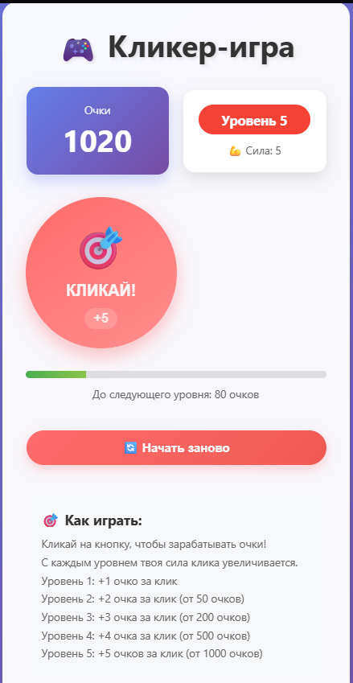

# 🖼️ Галерея изображений — Express API

## Описание
Backend-приложение на Express.js для управления галереей изображений.

## Функционал
- Просмотр списка изображений
- Загрузка новых изображений
- Удаление изображений
- Статический интерфейс для тестирования